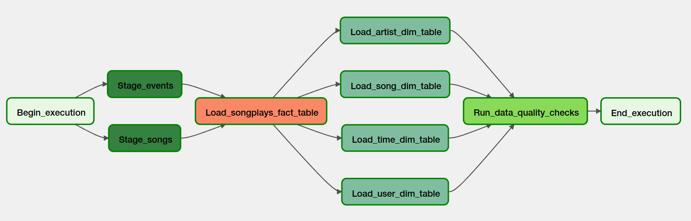

# Project: Data Pipeline with Airflow and AWS


> **Note:** This project is part of [Data Engineering with AWS nanodegree program](https://www.udacity.com/course/data-engineer-nanodegree--nd027).

## 1. Project Description
A music streaming company, _Sparkify_, has decided that it is time to introduce more automation and monitoring to their data warehouse ETL pipelines and come to the conclusion that the best tool to achieve this is **Apache Airflow**.

They expect to create **high grade data pipelines** that are _dynamic_ and built from _reusable tasks_, can be _monitored_, and allow _easy backfills_. They alsowant to run _tests_ against their datasets _after the ETL steps_ have been executed to catch any _discrepancies_ in the datasets.

### 🎯 Goal
**Created a _data pipeline_ using _Apache Airflow_ that performs _ETL_ on _AWS_.**

The pipeline steps include:
- _staging data_
- _filling the data warehouse_, and
- _running checks on the data_ as the final step.


## 2. Project Structure
```
project-airflow-aws
├── dags          # directory with Airflow DAG scripts
│   └── ...
├── notes          # directory with a few notes about the development
│   └── ...
├── plugins        # directory with custom helpers and Airflow operators
│   ├── helpers    # custom helpers
│   │   └── ...
│   ├── operators  # custom operators
│   │   └── ...
└── test           # directory with a few test scripts
    └── ...
```

## 3. Project data
> **Note:** The project data is the same of my [Data Warehouse Project](..project-data-warehouse).

The data is divided into 3 datasets that reside in S3 (`us-west-2` region). Here are the S3 links for each:
- **Song data: `s3://udacity-dend/song_data`:** static data about artists and songs Song-data example:

`{"num_songs": 1, "artist_id": "ARJIE2Y1187B994AB7", "artist_latitude": null, "artist_longitude": null, "artist_location": "", "artist_name": "Line Renaud", "song_id": "SOUPIRU12A6D4FA1E1", "title": "Der Kleine Dompfaff", "duration": 152.92036, "year": 0}`
- **Log data: `s3://udacity-dend/log_data`**: event data of service usage e.g. who listened what song, when, where, and with which client

- This third file `s3://udacity-dend/log_json_path.json` contains the meta information that is required by AWS **to correctly load** `s3://udacity-dend/log_data` using the `COPY command`.


## 4. Database Schema Design
**Staging Tables**: records the data from the files stored in S3.
- `staging_events`
- `staging_events`

**Fact Table**
- `songplays`: records in event data associated with _song plays_ (records with `page='NextSong'`)

**Dimension Tables**
- `users`: users in the app
- `songs`: songs in music database
- `artists`: artists in music database
- `time`: timestamps of records in songplays broken down into specific units


## 5. Preparing the workspace
- Create an **AWS IAM user** and a **AWS Redshift servless workspace**.
  - See [`./notes/configure_AWS.md`](./notes/configure_AWS.md) for more details.
- Install Airflow Locally (Ubuntu)
  - See [`./notes/install_airflow_ubuntu.md`](./notes/install_airflow_ubuntu.md) for more details.
- Setting up Connections between Airflow and AWS
  - See [`./notes/setup_airflow_connections_and_variables.md`](./notes/install_airflow_ubuntu.md) for more details.
- **Create the Data Warehouse Tables**
  - I coded a **DAG** to do create the **data warehouse tables**
  - **File:** `./dags/create_tables_dag.py`
  - Open the **Airflow UI**, enable and execute the DAG called `create_tables` 
  - Open the _Query Editor_ on AWS Redshift Servless or use [`SQL Workbench`](../project-data-warehouse/SQL_workbench_on_Redshift.md) to check the created tables
  > **Notes**: Initially, I tried to run a single `PostgresOperator` passing a sql file with all SQL creation statements. However, I got the error: 'cannot insert multiple commands into a prepared statement'. So, I converted the sql file to a python one and I modified my DAG to perform _multiple tasks_, **one for each SQL create statement.**

## 6. Data Pipeline
The proposed **Airflow data pipeline** can be found in `./dags/etl_dag.py`. It consists of a set of **tasks** defined by **custom Airflow operators**.

- To run it, go to **Airflow UI**, enable and run the **`etl` DAG**.

The diagram below shows the proposed data pipeline with Aiflow.



### Stage Operator
- **File:** `./plugins/operators/stage_redshift.py`

This **stage operator** is be able to load any _CSV and JSON formatted files_ from **S3 to Amazon Redshift**. The operator creates and runs a `SQL COPY statement` based on the parameters provided. 

- **`Stage_events`:** stage the original _log data_ from S3 to the **stating table** `staging_events`
- **`Stage_songs`:** stage the original song data_ from S3 to the **stating table** `staging_songs`

### Fact Operator
- **File:** `./plugins/operators/load_fact.py`

This operator transforms and loads data from the **staging tables** to a **fact table**. **Fact tables** are usually _so massive_ that they should only allow _append_ new data into it.

- **`Load_songplays_fact_table`:** transform and load data from the **staging tables** to the **fact table** `songplays`

### Dimension Operator
- **File:** `./plugins/operators/load_dimension.py`

This operator transforms and loads data from the **staging tables** to a **dimension table**. **Dimension loads** are often done with the _truncate-insert_ pattern where the target table is emptied before the load. Thus, we provided a parameter that allows switching between _insert modes_ when loading dimensions.

- **`Load_artist_dim_table`:** transform and load data from the **staging tables** to the **dimension table** `artists`
- **`Load_song_dim_table`:** transform and load data from the **staging tables** to the **dimension table** `songs`
- **`Load_time_dim_table`:** transform and load data from the **staging tables** to the **dimension table** `time`
- **`Load_user_dim_table`:** transform and load data from the **staging tables** to the **dimension table** `users`


### Data Quality Operator
- **File:** `./plugins/operators/data_quality.py`

This final operator performs **quality checks** to our final data:
- Check if the tables are not empty
- Check if some NOT NULL columns do not have NULL values

- **`Run_data_quality_checks`:** run the data quality checks to the final tables.
