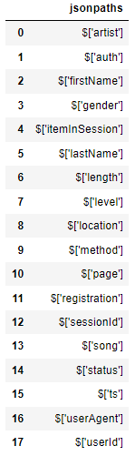

# Project: Build a Cloud Data Warehouse on AWS


> **Note:** This project is part of [Data Engineering with AWS nanodegree program](https://www.udacity.com/course/data-engineer-nanodegree--nd027).


## 1. Project Description
_Sparkify_ is a music streaming startup with a growing user base and song database.

The user activity and songs metadata are stored as json files in **AWS S3**. **The primary goal of this project is to build an efficient ETL (Extract, Transform, Load) pipeline.**
This pipeline will _extract_ the data from **AWS S3**, _stage_ it in **AWS Redshift**, and _transform it_ into a set of tables **(fact and dimensional)** in _star schema_. These tables will empower the analytics team to continue discovering valuable insights regarding the songs that Sparkify's users are listening to.

The figure below, provided by the original Project Description on Udacity, shows the proposed System Architecture for AWS S3 to Redshift ETL.


### 🎯 Goal
Build an efficient ETL (Extract, Transform, Load) pipeline with **AWS Redshift**.

## 2. Project Structure
```
project-data-warehouse
├── analytics.py                   # Script for analytics   
├── inspect_datasets.ipynb         # Notebook to inspect the datasets
├── create_tables.py               # Script that creates all tables in Redshift
├── dwh_template.cfg               # Template for the configuration file
├── etl.py                         # ETL builder
├── samples                        # folder that stores the dataset inspection
├── setup_AWS_resources.ipynb      # Setup the required resources on AWS
├── sql_queries.py                 # SQL query collections
├── SQL_workbench_on_Redshift.md   # Notes about how to connect SQL workbench to Redshift
└── teardown_AWS_resources.ipynb   # Notebook to teardown all allocated AWS resources
```

## 3. Project datasets
The data is divided into 3 datasets that reside in S3 (`us-west-2` region). Here are the S3 links for each:
- **Song data: `s3://udacity-dend/song_data`:** static data about artists and songs Song-data example:

`{"num_songs": 1, "artist_id": "ARJIE2Y1187B994AB7", "artist_latitude": null, "artist_longitude": null, "artist_location": "", "artist_name": "Line Renaud", "song_id": "SOUPIRU12A6D4FA1E1", "title": "Der Kleine Dompfaff", "duration": 152.92036, "year": 0}`
- **Log data: `s3://udacity-dend/log_data`**: event data of service usage e.g. who listened what song, when, where, and with which client

- This third file `s3://udacity-dend/log_json_path.json` contains the meta information that is required by AWS **to correctly load** `s3://udacity-dend/log_data` using the `COPY command`.


I provided a dataset overview in the `check_datasets.ipynb` jupyter notebook.

## 4. Database Schema Design
**Staging Tables**: records the data from the files stored in S3.
- `staging_events`
- `staging_events`

**Fact Table**
- `songplays`: records in event data associated with _song plays_ (records with `page='NextSong'`)

**Dimension Tables**
- `users`: users in the app
- `songs`: songs in music database
- `artists`: artists in music database
- `time`: timestamps of records in songplays broken down into specific units


## 5. Preparing the workspace
### 5.1. Create an AWS IAM user
- Create an AWS IAM user
- Save its `KEY` and `SECRECT`

### 5.2. Prepare the _configuration file_
- Rename the `dwh_template.cfg` to `dwh.cfg`
  - It contains all configuration required to access and manage AWS resources.
  - This has been pre-populated with some configuration:
    - `[AWS] REGION=us-west-2`: we keep the _same region_ of the S3 bucket of the datasets are stored in S3
    - `[S3]`: S3 configs, including the datasets' urls
    - `[DWS]`: Redshift data warehouse configs. We have considered a default cluster configuration.
- Insert your IAM user `KEY` and `SECRET` in the corresponding fields in `dwh.cfg`
- Insert the database configuration (cluster name, database name, user, password) of your preference over `[DWH]`
  
### 5.3. Prerequisites
```
pip install boto3
pip install pandas
pip install redshift_connector
```

## 6. How to run
### 6.1. (Optional) Inspect the datasets
The `check_datatasets.ipynb` notebook aims to inspect the dataset provided by the project. Although the project description on Udacity presents a lot of information about the datasets, such as their links and structures, I decided to double-check them to practice my coding skills with boto3 and S3.

### 6.2. Setup AWS Resources
Run the `setup_AWS_resources.ipynb` to ***setup all*** **AWS Resources** required for this project. Follow the instructions present in the notebook.

**Notes:**
- I created a cluster in the _same region_ of the S3 bucket to make the **copying time** from the _files_ to the _staging tables_ ***faster***.

### 6.3. Create Tables
`python create_tables.py`

It will create ***all* tables** in your **Redshift cluster** required for this project.

**Notes:**
- The `SQL_workbench_on_Redshift.md`  file contains my notes about how to connect [SQL Workbench](https://www.sql-workbench.eu) to a Redshift database.
- I did not consider any _constraint_ for the **staging tables** for _performance reasons_. The idea is to use them for staging the data before being processed and put into a data warehouse. By avoiding constraints we are ensuring maximum data is stored there and the time taken to load them is also fast. [\[link\]](https://knowledge.udacity.com/questions/586091)
- According to the [AWS official documentation](https://docs.aws.amazon.com/redshift/latest/dg/r_CREATE_TABLE_NEW.html), **uniqueness, primary key, and foreign key constraints are informational only; they are not enforced by Amazon Redshift when you populate a table.** Thus, I opted for just considering `PRIMARY KEY` and `NOT NULL`. See more on [\[link 1\]](https://docs.aws.amazon.com/redshift/latest/dg/c_best-practices-defining-constraints.html), [\[link 2\]](https://docs.aws.amazon.com/redshift/latest/dg/t_Defining_constraints.html).
- The `SERIAL` command in Postgres is not supported in Redshift. The equivalent in Redshift is `IDENTITY(0,1)`.
- Inspect the _created tables_ on **SQL Workbench**:
  - Use the `DBtree` or `DB explorer`, or
  - Execute the _SQL statement_: `SELECT * FROM information_schema.tables WHERE table_schema='public';`
- Other useful _SQL statements_ to inspect the database:
  - **Show only _your_ table names and their distribution styles in a readable way**
```
SELECT it.table_name, pg.releffectivediststyle,
CASE
    WHEN pg.releffectivediststyle  = 0 THEN 'EVEN' 
    WHEN pg.releffectivediststyle = 1 THEN 'KEY' 
    WHEN pg.releffectivediststyle = 8 THEN 'ALL' 
    WHEN pg.releffectivediststyle = 10 THEN 'AUTO(ALL)' 
    WHEN pg.releffectivediststyle = 11 THEN 'AUTO(EVEN)' 
    WHEN pg.releffectivediststyle = 12 THEN 'AUTO(KEY)' ELSE '<<UNKNOWN>>'
END AS diststyle
FROM information_schema.tables AS it
JOIN PG_CLASS_INFO AS pg ON (it.table_name = pg.relname)
WHERE it.table_schema='public';
```
  - **Show the column properties of your tables, including if the column is a `distkey` and `sortkey`**
```
SELECT * FROM PG_TABLE_DEF WHERE schemaname='public';
```

### 6.4. Perform ETL
`python etl.py`

Perform the **ETL** to the data. The script **copies** the data from the files in **S3 bucket** to the **staging tables** by the `COPY command`.

**Notes**:
- The resulting **copying time** was _5m 26s_.
- Copying the _song data_ took more time than the _event data_.
- Note that my **Redshift cluster** has been created in the same region (`us-west-2`) of the **S3 bucket** to make copying faster.
- During _SQL ETL_, I used `DISTINCT` to remove _duplicated rows_.
- To convert a _big int_ to a **timestamp**, we can do:
    - `SELECT DISTINCT TIMESTAMP 'epoch' + ts/1000 * INTERVAL '1 second' AS start_time, ...`
    - E.g.: `1541121934796` ==> `2018-11-02 01:25:34`
- Since I modeled the _column_ `ts` as a `BIGINT` in `staging_events`, and the corresponding _columns_ in the **star schema** as `TIMESTAMP` data type (`start_time` in `songplays`, `start_time` in `time`), I had to do this conversion during **ETL SQL**.
- **Copying by *inserting* the *staging tables* to the *star schema*** was fast! When compared to the `COPY command`, **it was really faster**. This have a reason: we are dealing with files during `COPY command`, so we have a _big overhead opening and closing several files_ to load the data.


### 6.5. Perform Analytics
`python analytics.py`

Perform some **analytical queries**.

#### Number of rows in each table
| Table | # rows |
|-------|--------|
|staging_events|8056|
|staging_songs|14896|
|artists|10025|
|songplays|333|
|songs|14896|
|time|6813|
|users|104|

#### What are the 5 most played artists?
| Artist | # plays |
|--------|---------|
|Dwight Yoakam|37|
|Kid Cudi / Kanye West / Common|10|
|Ron Carter|9|
|Lonnie Gordon|9|
|B.o.B|8|

#### What are the five most played songs?
| Artist | Song | # plays |
|--------|------|---------|
|Dwight Yoakam|You're The One|37|
|Ron Carter|I CAN'T GET STARTED|9|
|Lonnie Gordon|Catch You Baby (Steve Pitron & Max Sanna Radio Edit)|9|
|B.o.B|Nothin' On You \[feat. Bruno Mars\] (Album Version)|8|
|Usher|Hey Daddy (Daddy's Home)|6|


### 5.6. Teardown AWS Resources
Run the `teardown_AWS_resources.ipynb` to ***teardown*** **all AWS Resources** allocated before. Follow the instructions present in the notebook.

