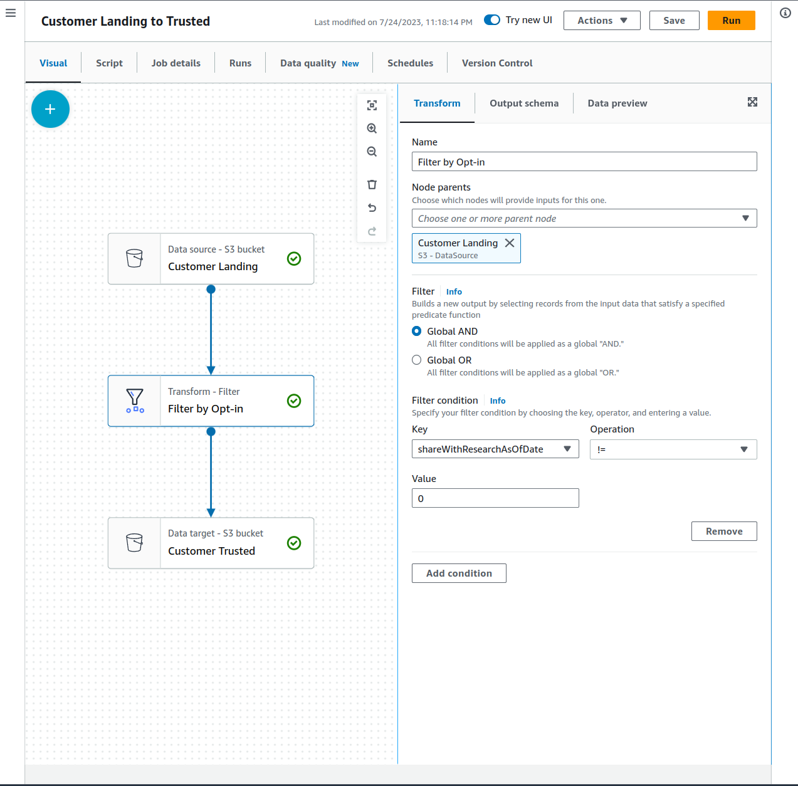

# Project: STEDI Human Balance Analytics - Data Lake and Spark on AWS


**Note:** This project is part of [Data Engineering with AWS nanodegree program](https://www.udacity.com/course/data-engineer-nanodegree--nd027).


## 1. Project Description
The **STEDI Human Balance Analytics** solution aims to help users to do a _STEDI balance exercise_. The STEDI Team has been hard at work developing a hardware **STEDI Step Trainer** that:
- trains the user to do a STEDI balance exercise;
- and has sensors on the device that collect data to train a machine-learning algorithm to detect steps;
- has a companion mobile app that collects customer data and interacts with the device sensors.

The **Step Trainer** is just a _motion sensor_ that records the _distance of the object detected_. The app uses a mobile phone _accelerometer_ to detect motion in the X, Y, and Z directions.

The STEDI team wants to use the motion sensor data to train a machine learning model to detect steps accurately in real-time. Some of the early adopters have agreed to _share their data for research purposes_, so that **privacy** will be a **primary consideration** in deciding _what data can be used._ **Only these customers’ Step Trainer and accelerometer data should be used in the training data for the machine learning model.**

### 🎯 Goal
Develop a _data engineering solution_ that _extracts_ the data produced by the STEDI Step Trainer sensors and the mobile app, and **curate** them into a **data **lakehouse** solution on AWS** so that Data Scientists can train the learning model.

## 2. Project Structure
```
project-spark-data-lake-aws
├── creating-s3-gateway-endpoint.md  # notes to configure a S3 Gateway Endpoint
├── jobs                             # Spark Jobs Python Scripts 
│   └── ...
├── screenshots                      # Screenshots of Glue Studio and AWS Athena
│   └── ...
└── sql                              # A few table creation SQLs from AWS Athena
    └── ...
```

## 3. Project data
STEDI has three _JSON data sources_ to use from the **Step Trainer**.

**1. Customer Records (from fulfillment and the STEDI website):**
- [Data Download URL](https://github.com/udacity/nd027-Data-Engineering-Data-Lakes-AWS-Exercises/tree/main/project/starter/customer)
- A total of _999 rows_ in a _single_ JSON file 
- Fields:
    - `customerName` string
    - `email` string
    - `phone` string
    - `birthDay` string
    - `serialNumber` string
    - `registrationDate` bigint
    - `lastUpdateDate` bigint
    - `shareWithResearchAsOfDate` bigint
    - `shareWithPublicAsOfDate` bigint

**2. Accelerometer Records (from the mobile app)**
- [Data Download URL](https://github.com/udacity/nd027-Data-Engineering-Data-Lakes-AWS-Exercises/tree/main/project/starter/accelerometer)
- A total of _744,413 rows_ across _ten_ JSON files 
- Fields:
    - `user` string
    - `timeStamp` bigint
    - `x` float
    - `y` float
    - `z` float

**3. Step Trainer Records (data from the motion sensor)**
- [Data Download URL](https://github.com/udacity/nd027-Data-Engineering-Data-Lakes-AWS-Exercises/tree/main/project/starter/step_trainer)
- A total of _239,760 rows_ across _eight_ JSON files 
- Fields:
    - `sensorReadingTime` bigint
    - `serialNumber` string
    - `distanceFromObject` int


## 4. Proposed Data Engineering Solution
My solution consists of building a **data lakehouse** for the STEDI data. This **data lakehouse** consists of _three zones_:
- **landing**: raw ingested data
- **trusted**: data from the _landing zone_ after some filtering, cleaning, and/or augmenting
- **curated**: data from the _trusted zone_ after the addition of some business-level aggregates.

I created a few **Spark Jobs** by _AW Glue_ to perform **ETL** on this data and to create the lakehouse.

The next sections presents an overview of my solution, including the configuration, Spark Jobs, and a few SQLs. Some sections are step-by-step for teaching purposes. 

### 4.1. Upload Raw Data to a S3 bucket
Let's upload the _project data_ (JSON files) from the original github repository to a **S3 bucket**. This **ingested data** will correspond to our ***landing zone***.

On AWS, open the **CloudShell terminal (AWS CLI)** and execute the steps below:
```
# create a S3 bucket
aws s3 mb s3://YOUR-S3-BUCKET-NAME

# download the github repo with the project data
git clone https://github.com/udacity/nd027-Data-Engineering-Data-Lakes-AWS-Exercises.git

# copy `customer` data
cd nd027-Data-Engineering-Data-Lakes-AWS-Exercises/project/starter/
aws s3 cp customer s3://YOUR-S3-BUCKET-NAME/customer/landing/

# copy `accelerometer` data
aws s3 cp accelerometer s3://YOUR-S3-BUCKET-NAME/accelerometer/landing/

# copy `step trainer` data
aws s3 cp step_trainer s3://YOUR-S3-BUCKET-NAME/step_trainer/landing/
```

**Notes:**
- Give a _proper name_ to your S3 bucket on `s3://YOUR-S3-BUCKET-NAME`
- The `aws s3 cp` command _automatically_ create folders and subfolder inside the S3 bucket if they do not exist
  - E.g., the command `aws s3 cp customer s3://YOUR-S3-BUCKET-NAME/customer/landing/` will automatically create the (sub-)folders `customer/landing/` inside the S3 bucket `YOUR-S3-BUCKET-NAME` and then will copy the folder `customer` to there.
- In order to automatically create a folder, you need to put a **_trailing slash_** after the folder name in the S3 URL. Otherwise, a file will be created.
  - E.g., `landing/` in `aws s3 cp customer s3://YOUR-S3-BUCKET-NAME/customer/landing/`


### 4.2. Configure the S3 Gateway Endpoint
By default, **Glue Jobs** can't reach any networks _outside_ of your **Virtual Private Cloud (VPC)**. Since the **S3 Service** runs in _different network_, we need to create what's called an **S3 Gateway Endpoint**. This allows S3 traffic from your Glue Jobs into your S3 buckets. Once we have created the endpoint, your Glue Jobs will have a network path to reach S3.

Using _AWS Glue_ to run **Spark Jobs** requires the following resources and configuration:


The step-by-step instructions to configure the S3 Gateway Endpoint can be found in [`creating-s3-gateway-endpoint.md`](./creating-s3-gateway-endpoint.md).


### 4.3. Inspect Landing Zone Data by Glue Studio and AWS Athena
We can use AWS to create a **relational database** to _manipulate_ our data directly from a _S3 bucket_. We can use **Glue Studio** to _manage_ **databases** and **tables** from data in **S3**. We can usse **AWS Athena** to execute _SQL statements_ on our data.

#### Create a Database for our project data
Go to **Glue Dashboard > Data Catalog (side menu) > Databases**
- Add Database
  - **Database name**: `steadi`
  - Create database

Although we can also use the **Glue Dashboard (Data Catalog)** to _create tables_ in the database, we will use **AWS Athena**.

#### Set up a _query result location_ for Athena in Amazon S3
On **AWS Athena Dashboard**
- Click on `Edit settings`
- **Location of query result:** `s3://YOUR-S3-BUCKET-NAME/athena/`
    - the _ending trailing slash_ is important to indicate that `athena` is a folder

#### Create a _table_ for the `Customer` Landing data
**NB:** I will only provide a step-by-step for this table creation.

On **AWS Athena Dashboard**, Go to ***Query editor (side menu)***:
- **Database:** `steadi`
- Click on `Create` > Create a table from data source > S3 bucket data
    - **table name:** customer_landing
    - **Choose an existing database:** `steadi`
    - **Data store:** S3
    - **Location of input data set:** `s3://YOUR-S3-BUCKET-NAME/customer/landing/`
    - **Table type:** Apache Hive
    - **Format:** JSON
    - On column details, or you add each column _manually_ or you **bulk the column names**
    - **Bulk add columns**
        - `customerName string, email string, phone string, birthDay string, serialNumber string, registrationDate bigint, lastUpdateDate bigint, shareWithResearchAsOfDate bigint, shareWithPublicAsOfDate bigint`
    
See `sql/customer_landing.sql` for the resulting SQL.


#### Create a _table_ for the `Accelerometer` Landing data
- **table name:**: `accelerometer_landing`
- **Location of input data set:**: `s3://YOUR-S3-BUCKET-NAME/accelerometer/landing/`
- **Bulk add columns**
    - `user string, timeStamp bigint, x float, y float, z float`

See `sql/accelerometer_landing.sql` for the resulting SQL.


#### Create a _table_ for the `Step Trainer` Landing data
- **table name:**: `step_trainer_landing`
- **Location of input data set:**: `s3://YOUR-S3-BUCKET-NAME/step_trainer/landing/`
- **Bulk add columns**
    - `sensorReadingTime bigint, serialNumber string, distanceFromObject int`

See `sql/accelerometer_landing.sql` for the resulting SQL.

#### Inspect Data from the Landing Zone
On _AWS Athena_, I performed a _full table scan_ in the three tables:

**Customer Landing Data**:
- `SELECT * FROM customer_landing`
  - 999 rows
  - Note there is a single JSON file for this data on `s3://YOUR-S3-BUCKET-NAME/customer/landing/`

 <br/>

**Accelerometer Landing Data**
- `SELECT * FROM accelerometer_landing;`
  - 744,413 rows
  - Note there are 10 json files in `s3://YOUR-S3-BUCKET-NAME/accelerometer/landing/` which are equally formatted
  - During table creation, **Athena** scans and ingests the data from **ALL** files in the specified bucket

 <br/>

**Step Trainer Landing Data**
- `SELECT * FROM step_trainer_landing;`
  - 239,760 rows
  - Note there are 8 json files in `s3://YOUR-S3-BUCKET-NAME/step_trainer/landing/` which are equally formatted

 <br/>


### 4.4. Spark Job to transform Customer LANDING to TRUSTED data
I used **Glue Studio** to create _ETL jobs_ that _extracts_, _transforms_, and _loads_ our data from S3. I used its _Visual ETL_ tool to visually create this job. I saved the corresponding _PySpark_ codes in the [`./jobs` folder](./jobs).

- Sanitize the Customer data from the Website (Landing Zone) and _only store_ the Customer Records who **agreed to share their data for research purposes (Trusted Zone)**.
- The field `sharewithresearchasofdate` is a _timestamp_ (unixtime in ms) that indicates when the user accepted to share his/her data.
- _Empty_ or `0` indicate the user did not consent.
- To convert an unixtime _timestamp_ to a readable format, we can use: `FROM_UNIXTIME(sharewithresearchasofdate / 1000e0)`
  - E.g.: `1655296571764` --> `2022-06-15 12:36:11.764`

 <br/>

**Notes:**
- The resulting data was saved in the S3 bucket: `s3://YOUR-S3-BUCKET-NAME/customer/trusted/`
- The trusted data has `497` records
  - While I thought the `email` was the **primary key**, <span style='background-color: #ff9ca2;'>inspecting the dataset I found that **it wasn't**.</span>
  - <span style='background-color: #ff9ca2;'>There are many records with **duplicated emails**.</span>
    - E.g., `SELECT * FROM customer_trusted WHERE email = 'Edward.Hansen@test.com';`
    - It results in two records with this email
  - So, be aware because any future JOIN with other tables (e.g., `accelerometer`) will result in **duplicate records**. 
- An alternative is to perform the following query _directly_ from the _landing data_
  - `SELECT * FROM customer_landing WHERE sharewithresearchasofdate != 0;`
- **PySpark script:** [`./jobs/customer_landing_to_trusted.py`](./jobs/customer_landing_to_trusted.py)


**FULL TABLE SCAN**
 <br/>


### 4.5. Spark Job to transform Accelerometer LANDING to TRUSTED data
- Accelerometer readings only from Customers **who have consented** to share their data for research.
- I also filtered out any _accelerometer readings_ that **were prior to the research consent date** in order to ensure consent was in place at the time that data was gathered.
  - _Privacy Filter by Date_

- Although we have a **one to many** relationship between `Customer` and `Accelerometer`, the JOIN will generate duplicate records because the `email` is not a **primary key** for `Customer` (since there are many records with **duplicated emails**). To handle that, I added a step to _remove duplications_ in our _accelerometer data_ before saving it into the bucket. Note that this would not be necessary if the `email` was a true **primary key**.

 <br/>

**Notes:**
- The resulting data was saved in the S3 bucket: `s3://YOUR-S3-BUCKET-NAME/accelerometer/trusted/`
- The trusted data has `299,965` records
- **PySpark script:** [`./jobs/accelerometer_landing_to_trusted_zone.py`](./jobs/accelerometer_landing_to_trusted_zone.py)


### 4.6. Spark Job to transform Customer TRUSTED to CURATED data
- _Sanitize_ the **Customer data (Trusted Zone)** that _only_ includes customers _who have accelerometer data_ and _have agreed to share their data for research_ called **customers_curated**.
- _Anonymize_ the final **curated table** so that it is not subject to _GDPR_ or other _privacy regulations_, in case a customer requests deletion of PII, we will not be in violation by retaining PII data --remove email, and any other personally identifying information up front.

 <br/>

**Notes:**
- The resulting data was saved in the S3 bucket: `s3://YOUR-S3-BUCKET-NAME/customer/curated/`
- _Anonymization_ removes the PII fields:
  - `birthday`, `customerName`, `email`, `phone`
- The new fields
  - `serialNumber string, shareWithPublicAsOfDate bigint, registrationDate bigint, shareWithResearchAsOfDate bigint, lastUpdateDate bigint, shareWithFriendsAsOfD bigint`
- The curated data has `497` records
- **PySpark script:** [`./jobs/customer_trusted_to_curated.py`](./jobs/customer_trusted_to_curated.py)


### 4.7. Spark Job to transform Customer TRUSTED to CURATED data
- Read the **Step Trainer IoT data stream** (in S3) and populate a **Trusted Zone Glue Table** called `step_trainer_trusted` that contains the **Step Trainer Records data** for customers _who have accelerometer data and have agreed to share their data for research_ (**customers_curated**).


 <br/>

**Notes:**
- The resulting data was saved in the S3 bucket: `s3://YOUR-S3-BUCKET-NAME/step_trainer/trusted/`
- Renamed keys_ rename the `serialNumber` column from `Customer` to avoid multiple columns with _the same name_
- Since **Customer Curated** _only_ contains customers who have agreed to share their data for research, _Privace Filter_ is simply a JOIN between both tables to filter the **step trainer** data for these customers
- The trusted data has `29,970` records
- **PySpark script:** [`./jobs/step_trainer_landing_to_trusted.py`](./jobs/step_trainer_landing_to_trusted.py)


### 4.7. Spark Job to aggregate TRUSTED Accelerometer and Step Trainer data
Create an _aggregated table_ that has each of the **Step Trainer Readings**, and the **associated accelerometer reading data** for _the same timestamp_, but only for _customers who have agreed to share their data_, and make a glue table called **machine_learning_curated**.

 <br/>

**Notes:**
- The resulting data was saved in the S3 bucket: `s3://YOUR-S3-BUCKET-NAME/machine_learning/curated/`
- The curated data has `36,319` records
- Fields: `serialNumber string, sensorReadingTime bigint, distanceFromObject int, z double, timeStamp bigint, user string, y double, x double`
- **PySpark script:** [`./jobs/machine_learning_curated.py`](./jobs/machine_learning_curated.py)


